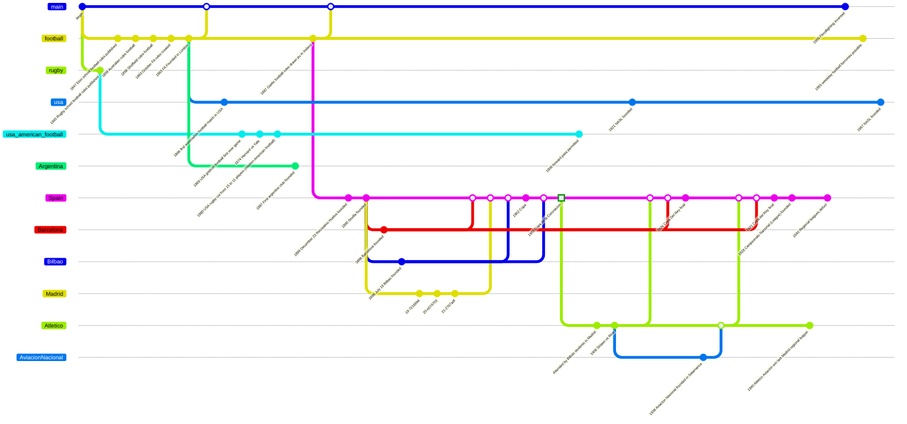
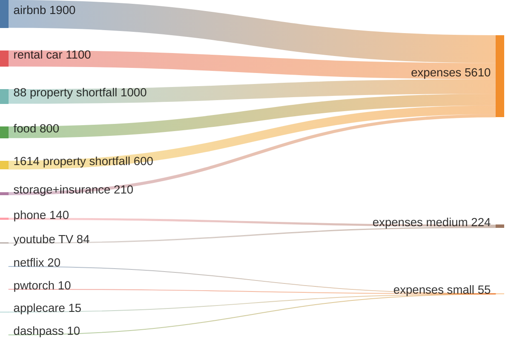
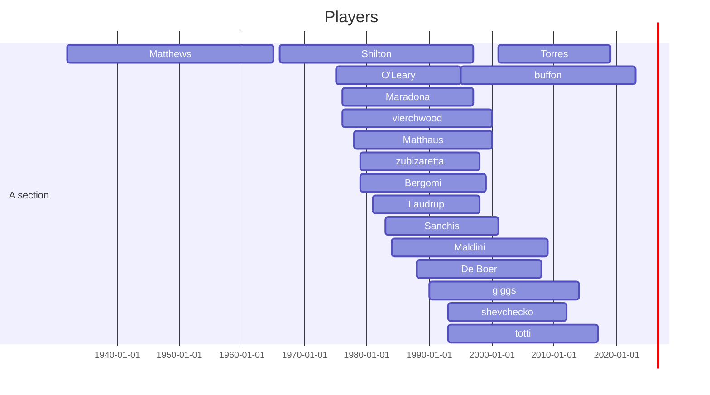
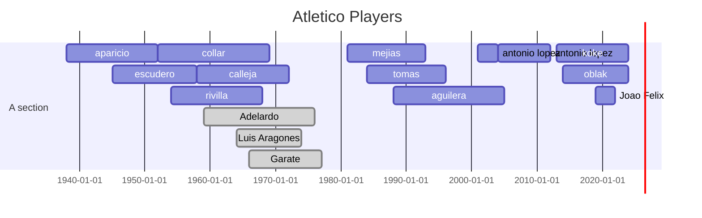
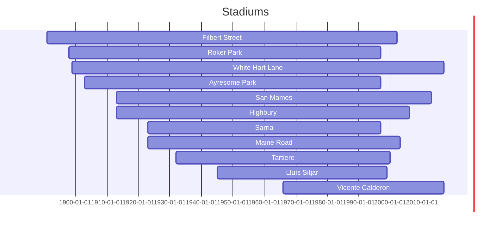
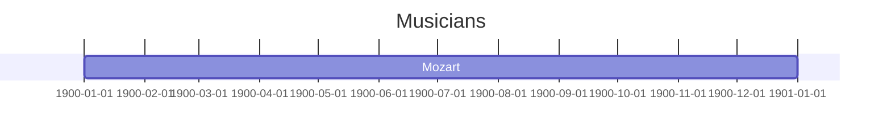
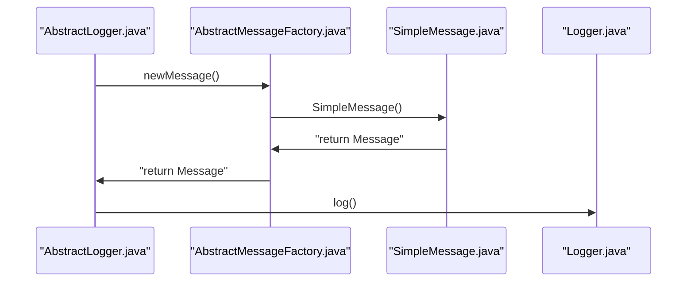
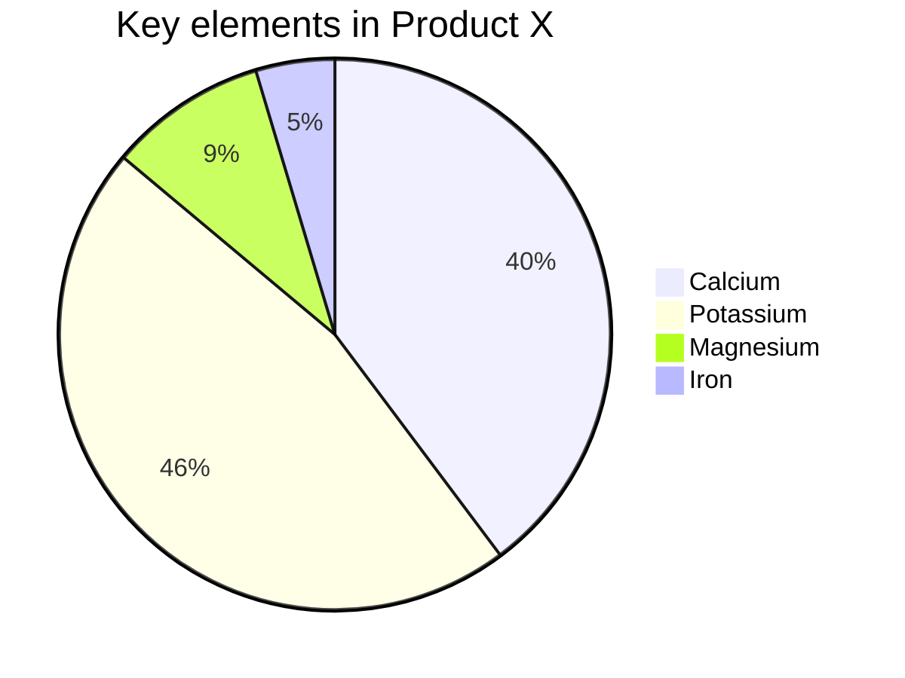

# mermaid

## 2025
Summary of diagram types:
* https://mermaid.live/edit
* https://mermaid.js.org/intro/

## 2024
### gitgraph / railroad
https://github.com/sarnobat/atleticomadrid?tab=readme-ov-file#atleticomadrid

* TODO 2024-04-24: rotate existing, and add all articles as plaintext files (txt or mwk, not html I think)



Only use tracks for longitudinal entities. Parma wouldn't have much for example (though it would be good to explain their sudden rise from obscurity).


### Budget monthly

### soccer players spanning significant periods




## 2023
### Atletico players



### Stadiums
see also: https://docs.google.com/spreadsheets/d/1wopT5qG15EK1-_W8MO2E5Qeu--ashat0A70WFishQ7I/edit?gid=0#gid=0


### Musicians
see also:
* https://docs.google.com/spreadsheets/d/1a8LbwMELrVSXFf-VJ54fop96Cmk_pPUq9ezvaqk-41g/edit?gid=0#gid=0
* https://docs.google.com/spreadsheets/d/1K2K2Is2F2mY2l5gQZ9RBPOK0IRQWak8SNxzKVGvxv1E/edit?gid=1210820633#gid=1210820633
* 



### Sequence diagram



Sequence diagrams are better than data flow diagrams for typical OOP code (with mutable state) because the data flow is chained rather than linear, and the column alignment by class allows you to see the common class easily

Options for sequence diagrams:
* Qsde
* Textdiagram
* Mermaid
* Plantuml
* Textart.io (ASCII.sequence: https://textart.io/sequence, https://github.com/weidagang/text-diagram)
   * I've made a command line version here: ~/src.git/javascript/sequence_diagram/text-diagram.js
* adia

```
+---------------------+         +-------------------------+                 +---------------+ +-------------+    +-----------------------------------------+  +-------------------------+   +-----------------------+ +-----------------------------------+ +---------------------+   +---------------------------+
| AbstractLogger_java |         | AbstractMessageFactory  |                 | SimpleMessage | | Logger_java |    | AwaitCompletionReliabilityStrategy_java |  | AsyncLoggerConfig_java  |   | AppenderControl_java  | | AbstractOutputStreamAppender_java | | AbstractLayout_java |   | OutputStreamManager_java  |
+---------------------+         +-------------------------+                 +---------------+ +-------------+    +-----------------------------------------+  +-------------------------+   +-----------------------+ +-----------------------------------+ +---------------------+   +---------------------------+
           |                                 |                                      |                |                                |                                    |                            |                               |                              |                            |
           | newMessage(string)              |                                      |                |                                |                                    |                            |                               |                              |                            |
           |-------------------------------->|                                      |                |                                |                                    |                            |                               |                              |                            |
           |                                 |                                      |                |                                |                                    |                            |                               |                              |                            |
           |                                 | return SimpleMessage(string)         |                |                                |                                    |                            |                               |                              |                            |
           |                                 |------------------------------------->|                |                                |                                    |                            |                               |                              |                            |
           |                                 |                                      |                |                                |                                    |                            |                               |                              |                            |
           |                                 |                        SimpleMessage |                |                                |                                    |                            |                               |                              |                            |
           |                                 |<-------------------------------------|                |                                |                                    |                            |                               |                              |                            |
           |                                 |                                      |                |                                |                                    |                            |                               |                              |                            |
           |                  return Message |                                      |                |                                |                                    |                            |                               |                              |                            |
           |<--------------------------------|                                      |                |                                |                                    |                            |                               |                              |                            |
           |                                 |                                      |                |                                |                                    |                            |                               |                              |                            |
           | log(Message)                    |                                      |                |                                |                                    |                            |                               |                              |                            |
           |---------------------------------------------------------------------------------------->|                                |                                    |                            |                               |                              |                            |
           |                                 |                                      |                |                                |                                    |                            |                               |                              |                            |
           |                                 |                                      |                | log(data)                      |                                    |                            |                               |                              |                            |
           |                                 |                                      |                |------------------------------->|                                    |                            |                               |                              |                            |
           |                                 |                                      |                |                                |                                    |                            |                               |                              |                            |
           |                                 |                                      |                |                                | log(event : LogEvent)              |                            |                               |                              |                            |
           |                                 |                                      |                |                                |----------------------------------->|                            |                               |                              |                            |
           |                                 |                                      |                |                                |                                    |                            |                               |                              |                            |
           |                                 |                                      |                |                                |                                    | callAppender()             |                               |                              |                            |
           |                                 |                                      |                |                                |                                    |--------------------------->|                               |                              |                            |
           |                                 |                                      |                |                                |                                    |                            |                               |                              |                            |
           |                                 |                                      |                |                                |                                    |                            | append()                      |                              |                            |
           |                                 |                                      |                |                                |                                    |                            |------------------------------>|                              |                            |
           |                                 |                                      |                |                                |                                    |                            |                               |                              |                            |
           |                                 |                                      |                |                                |                                    |                            |                               | encode()                     |                            |
           |                                 |                                      |                |                                |                                    |                            |                               |----------------------------->|                            |
           |                                 |                                      |                |                                |                                    |                            |                               |                              |                            |
           |                                 |                                      |                |                                |                                    |                            |                               |                              | writeBytes()               |
           |                                 |                                      |                |                                |                                    |                            |                               |                              |--------------------------->|
           |                                 |                                      |                |                                |                                    |                            |                               |                              |                            |


```


### TODO: Wimbledon victories (gantt)


### Nutrition info
Find low carb foods.


