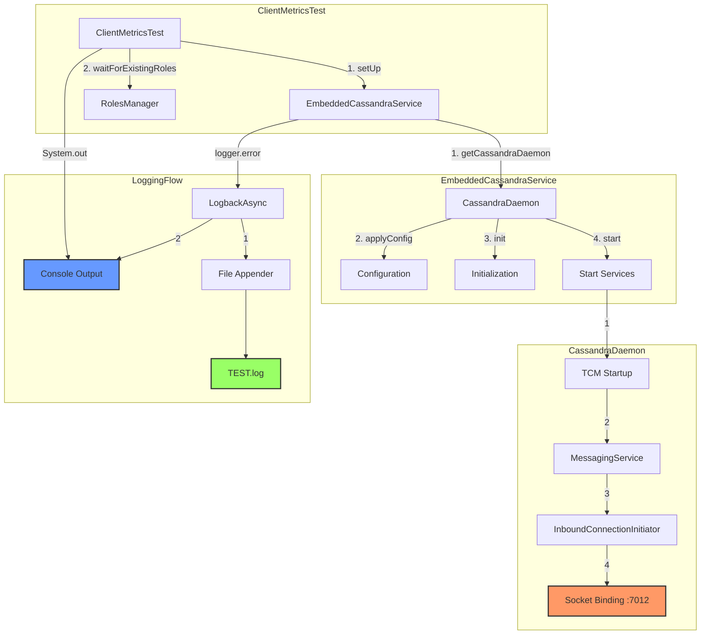

```mermaid
flowchart TB
    subgraph ClientMetricsTest
        CMT[ClientMetricsTest] --> |1. setUp| ECS[EmbeddedCassandraService]
        CMT --> |2. waitForExistingRoles| Roles[RolesManager]
    end

    subgraph EmbeddedCassandraService
        ECS --> |1. getCassandraDaemon| CD[CassandraDaemon]
        CD --> |2. applyConfig| Config[Configuration]
        CD --> |3. init| Init[Initialization]
        CD --> |4. start| Start[Start Services]
    end

    subgraph CassandraDaemon
        Start --> |1| TCM[TCM Startup]
        TCM --> |2| MS[MessagingService]
        MS --> |3| ICI[InboundConnectionInitiator]
        ICI --> |4| Socket[Socket Binding :7012]
    end

    subgraph LoggingFlow
        CMT --> |System.out| Console[Console Output]
        ECS --> |logger.error| LA[LogbackAsync]
        LA --> |1| File[File Appender]
        LA --> |2| Console
        File --> LogFile[TEST.log]
    end

    style Socket fill:#f96,stroke:#333,stroke-width:2px
    style LogFile fill:#9f6,stroke:#333,stroke-width:2px
    style Console fill:#69f,stroke:#333,stroke-width:2px
```
